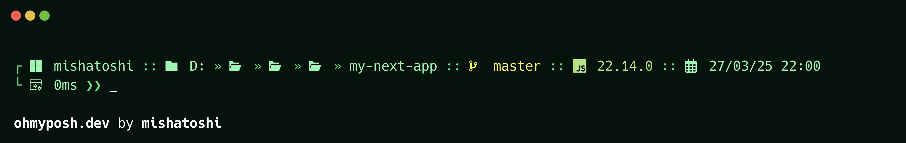
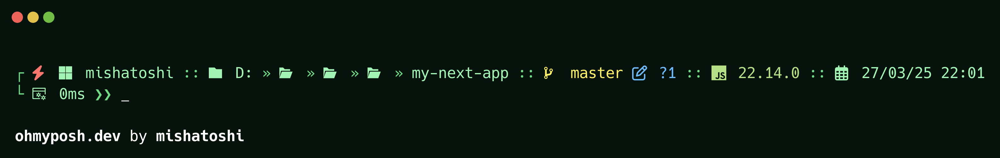

  
  <h1>Oh My Posh</h1>

  <h2>User mode</h2>
  

  <h2>Administrator mode</h2>
  

## Installation

1. Install **Oh My Posh** [https://ohmyposh.dev](https://ohmyposh.dev)
1. Download the **raw file** [mojito-pro.omp.json](https://github.com/mishatoshi/mojito-pro-oh-my-posh-theme/blob/main/mojito-pro.omp.json) and save it where it is convenient for you
1. Write down the path to your theme:
    * Windows
        * In Powershell, run `notepad $PROFILE`
        * In the file **Microsoft.PowerShell_profile.ps1** write down the following path `oh-my-posh init pwsh --config 'WRITE DOWN THE PATH TO YOUR THEME' | Invoke-Expression`
    * Linux
        * In the file **.bashrc** write down the following path `eval "$(oh-my-posh init bash --config ~/WRITE DOWN THE PATH TO YOUR THEME)"`
    * Mac
        * In the file **.zshrc** write down the following path `eval "$(oh-my-posh init zsh --config ~/WRITE DOWN THE PATH TO YOUR THEME)"`

## Fonts

Nerd Fonts are required for the Mojito Pro theme. To display all icons, the use of [Nerd Fonts](https://www.nerdfonts.com) is recommended. More information on fonts can be found [here](https://ohmyposh.dev/docs/installation/fonts)

## Other versions

* Windows Terminal, PowerShell, CMD [https://github.com/mishatoshi/mojito-pro-windows-terminal](https://github.com/mishatoshi/mojito-pro-windows-terminal)
* Visual Studio Code [https://github.com/mishatoshi/mojito-pro-vscode-theme](https://github.com/mishatoshi/mojito-pro-vscode-theme)
* Flow Launcher [https://github.com/mishatoshi/mojito-pro-flowlauncher-theme](https://github.com/mishatoshi/mojito-pro-flowlauncher-theme)

## License

[MIT License](./LICENSE)

<h3 align="center">Don’t worry, be happy😍</h3>
