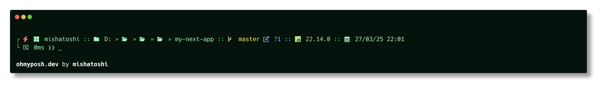

  
  <h1>Mojito Pro for Oh My Posh</h1>
  <h3>🍃 Easy on the eyes, boosting productivity!</h3>

  <h2>User mode</h2>
  

  <h2>Administrator mode</h2>
  

## Installation

1. Install Oh My Posh [https://ohmyposh.dev](https://ohmyposh.dev)
2. Download the raw file [mojito-pro.omp.json](https://github.com/mishatoshi/mojito-pro-oh-my-posh-theme/blob/main/mojito-pro.omp.json) and move it to the `oh-my-posh/themes` folder

## Activating Theme

For instructions on activating this theme in **powershell**, **cmd**, **xsh**, **bash**, **fish** and **nu** please refer to the documentation [here](https://ohmyposh.dev/docs/installation/customize)

## Fonts

Nerd Fonts are required for the Mojito Pro theme. To display all icons, the use of [Nerd Fonts](https://www.nerdfonts.com) is recommended. More information on fonts can be found [here](https://ohmyposh.dev/docs/installation/fonts)

## Other versions

* Windows Terminal, PowerShell, CMD [https://github.com/mishatoshi/mojito-pro-windows-terminal](https://github.com/mishatoshi/mojito-pro-windows-terminal)
* Visual Studio Code [https://github.com/mishatoshi/mojito-pro-vscode-theme](https://github.com/mishatoshi/mojito-pro-vscode-theme)
* Flow Launcher [https://github.com/mishatoshi/mojito-pro-flowlauncher-theme](https://github.com/mishatoshi/mojito-pro-flowlauncher-theme)

## License

[MIT License](./LICENSE)

<h3 align="center">Don’t worry, be happy😍</h3>
